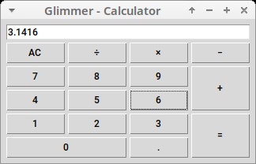

# Personal test for Glimmer DSL for Tk

I wanted to try how it feels to write an UI in
[glimmer-dsl-tk](https://github.com/AndyObtiva/glimmer-dsl-tk) so I decided to
write an alternative version of the
[Glimmer Calculator](https://github.com/AndyObtiva/glimmer-cs-calculator) that
uses Tk and runs in the regular MRI Ruby interpreter.

The model and the infrasctructure code are directly stolen from the original
Glimmer Calculator. I only rewrote the view. This is how it looks in my Linux
system with the default Tk theme.

## Copyright

[MIT](https://opensource.org/licenses/MIT)

Since most of the code is taken from Glimmer Calculator, I'm keeping the
copyright (c) 2020 Andy Maleh. See [LICENSE.txt](LICENSE.txt) for further details.

